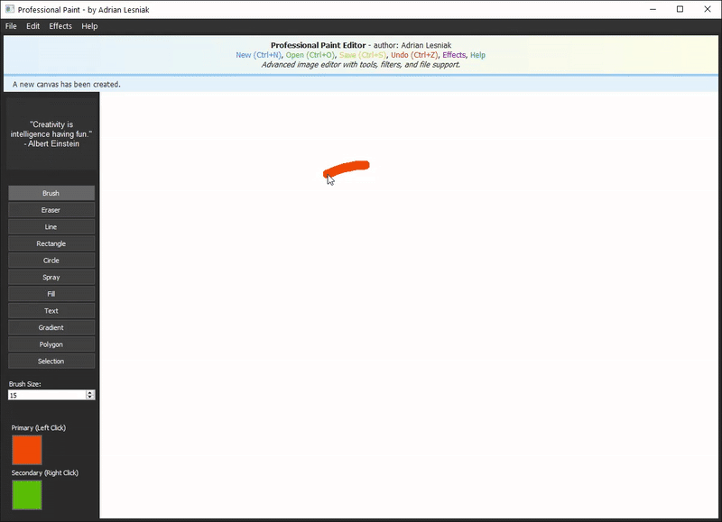

# 🎨🖌️ PyQt PaintMaster: Professional Image Editor ✨
_A versatile desktop image editing application built with Python and PyQt5, offering a rich set of drawing tools, shape tools, image filters, and effects._

[](https://opensource.org/licenses/MIT) <!-- Assuming MIT if not specified -->
[](https://www.python.org/)
[](https://riverbankcomputing.com/software/pyqt/intro)
[]() <!-- No official Pillow logo for shields.io -->

## 📋 Table of Contents
1.  [Overview](#-overview)
2.  [Key Features](#-key-features)
    *   [Drawing & Shape Tools](#-drawing--shape-tools)
    *   [Image Effects & Adjustments](#-image-effects--adjustments)
    *   [Core Functionality](#-core-functionality)
3.  [Keyboard Shortcuts](#-keyboard-shortcuts)
4.  [Screenshots (Conceptual)](#-screenshots-conceptual)
5.  [System Requirements & Dependencies](#-system-requirements--dependencies)
6.  [Installation](#️-installation)
7.  [Running the Application](#️-running-the-application)
8.  [File Structure (Expected)](#-file-structure-expected)
9.  [Contributing](#-contributing)
10. [License](#-license)
11. [Author & Contact](#-author--contact)

## 📄 Overview

**PyQt PaintMaster: Professional Image Editor**, created by Adrian Lesniak, is a desktop application designed to provide a comprehensive suite of tools for image creation and manipulation. Built with **Python** and the **PyQt5** GUI framework, it aims to offer a user-friendly yet powerful experience similar to professional paint programs. Users can leverage a variety of drawing tools, create geometric shapes, apply image filters and effects, manage colors, and perform essential file operations. The application also supports crucial productivity features like undo/redo and keyboard shortcuts.

<br> 
<p align="center">
  
</p>
<br>

## ✨ Key Features

### 🖌️ Drawing & Shape Tools
*   **Brush**: Free-form drawing with customizable brush size/type (assumed).
*   **Eraser**: Erase portions of the image or specific layers.
*   **Spray**: Simulate a spray paint effect for textured application of color.
*   **Line Tool**: Draw straight lines between two points.
*   **Rectangle Tool**: Draw rectangles and squares (hold Shift for square - assumed).
*   **Circle/Ellipse Tool**: Draw circles and ellipses.
*   **Fill Tool (Paint Bucket)**: Fill contiguous areas with a selected color.
*   **Text Tool**: Add and format text overlays on the image.
*   **Gradient Tool**: Create smooth color transitions and gradient fills.
*   **Polygon Tool**: Draw custom multi-sided shapes by defining vertices.
*   **Selection Tools**: (e.g., rectangular marquee, free-form lasso - assumed) Select specific areas of the image for targeted editing, copying, or moving.

### 🪄 Image Effects & Adjustments
*   **Blur**: Apply various blur effects (e.g., Gaussian, box).
*   **Sharpen**: Enhance the sharpness and detail of an image.
*   **Grayscale**: Convert the image to shades of gray.
*   **Invert Colors**: Invert all colors in the image.
*   **Brightness Adjustment**: Modify the overall brightness of the image.
*   **Contrast Adjustment**: Alter the contrast levels in the image.

### ⚙️ Core Functionality
*   **Color Picker**: Select foreground and background colors using a visual color palette or by inputting color codes.
*   **File Operations**:
    *   Create a **New Image** (Ctrl+N).
    *   **Open** existing image files (Ctrl+O) (e.g., PNG, JPG, BMP - supported by Pillow).
    *   **Save** the current image (Ctrl+S) in various formats.
*   **Undo/Redo Support**:
    *   **Undo** previous actions (Ctrl+Z).
    *   **Redo** undone actions (Ctrl+Y).
*   **Canvas Management**: A central drawing area where image editing takes place.
*   **Layers**: (Potential feature, not explicitly listed but common in "professional" editors) Ability to work with multiple image layers.
*   **Zoom & Pan**: (Assumed) Controls to zoom in/out and pan across the image canvas.

## ⌨️ Keyboard Shortcuts

*   **`Ctrl + N`**: Create a New Image
*   **`Ctrl + O`**: Open an Existing Image
*   **`Ctrl + S`**: Save the Current Image
*   **`Ctrl + Z`**: Undo the last action
*   **`Ctrl + Y`**: Redo the last undone action
*   *(Additional shortcuts for tools, e.g., `B` for Brush, `E` for Eraser, would be typical)*

## 🖼️ Screenshots (Conceptual)

_Screenshots of the PyQt PaintMaster application, including: the main interface with a canvas, toolbars, menu bar, color picker, layer panel (if applicable), and examples of drawing tools and image effects being applied._

<p align="center">
  
  
  
  
  
  
  
  
  
  
</p>


## ⚙️ System Requirements & Dependencies

### Software:
*   **Python**: Version 3.6 or higher.
*   **Libraries**:
    *   `PyQt5`: For the graphical user interface framework.
    *   `Pillow` (PIL Fork): For image file loading, saving, and manipulation operations.

### Operating System:
*   Any OS that supports Python 3.6+ and PyQt5 (e.g., Windows, macOS, Linux).

## 🛠️ Installation

1.  **Ensure Python 3.6+ is Installed**:
    Verify by typing `python --version` or `python3 --version` in your terminal. If not installed, download from [python.org](https.www.python.org/).

2.  **Clone or Download the Repository (if applicable)**:
    ```bash
    git clone <repository-url>
    cd <repository-directory>
    ```
    *(Replace `<repository-url>` and `<repository-directory>` if this project is hosted on Git).*

3.  **Set Up a Virtual Environment (Recommended)**:
    ```bash
    python -m venv venv
    source venv/bin/activate  # On Windows: venv\Scripts\activate
    ```

4.  **Install Required Libraries**:
    Open your terminal or command prompt (with the virtual environment activated if you created one) and run:
    ```bash
    pip install PyQt5 Pillow
    ```
    *(If a `requirements.txt` file is provided in the future, you can use `pip install -r requirements.txt` instead).*

## ▶️ Running the Application

1.  Navigate to the project directory in your terminal (the one containing `main.py`).
2.  Ensure your virtual environment is activated (if you created one).
3.  Run the application using Python:
    ```bash
    python main.py
    ```
4.  The PyQt PaintMaster application window should open.

## 🗂️ File Structure (Expected)

*   `main.py`: The main Python script that initializes the PyQt5 application, sets up the main window, and integrates all the UI elements, tools, and image processing logic.
*   (Potentially other Python modules/files for):
    *   `canvas.py`: Class for the main drawing canvas widget.
    *   `toolbar.py`: Logic for creating and managing toolbars.
    *   `menubar.py`: Logic for creating and managing the menu bar.
    *   `tools/`: A directory containing separate modules for each drawing tool.
    *   `effects/`: A directory for image effect implementations.
    *   `ui/`: Directory for any `.ui` files if using Qt Designer.
*   `assets/` or `icons/`: (Optional) Directory for any custom icons used in the UI.
*   `README.md`: This documentation file.

## 📝 Technical Notes

*   **GUI Framework**: The application is built using PyQt5, a comprehensive set of Python bindings for Qt libraries, enabling the creation of rich desktop GUIs.
*   **Image Processing**: Pillow (a fork of the Python Imaging Library - PIL) is used for backend image manipulation tasks such as opening/saving various file formats and applying filters/effects that are not directly handled by Qt's image classes.
*   **Object-Oriented Design**: A professional paint editor would typically employ a strong object-oriented design, with classes for tools, shapes, image layers, effects, and UI components.
*   **Event Handling**: PyQt5's signal and slot mechanism is used for handling user interactions (mouse clicks, key presses, menu selections).
*   **Performance**: For a responsive user experience, especially with large images or complex operations (like blur), efficient algorithms and potentially threading or multiprocessing for certain tasks would be important.

## 🤝 Contributing

Contributions to **PyQt PaintMaster** are highly encouraged! If you have ideas for:

*   Adding new drawing tools or shape tools.
*   Implementing more advanced image filters and effects.
*   Improving the user interface and user experience (UI/UX).
*   Enhancing performance for large images or complex operations.
*   Adding support for more image file formats.
*   Implementing a layer system.
*   Writing unit tests or documentation.

1.  Fork the repository.
2.  Create a new branch for your feature (`git checkout -b feature/LayerSystem`).
3.  Make your changes to the Python scripts.
4.  Commit your changes (`git commit -m 'Feature: Implement basic layer system'`).
5.  Push to the branch (`git push origin feature/LayerSystem`).
6.  Open a Pull Request.

Please ensure your code is well-commented, follows Python best practices (e.g., PEP 8), and includes type hints where appropriate.

## 📃 License

This project is licensed under the **MIT License**.
(If you have a `LICENSE` file in your repository, refer to it: `See the LICENSE file for details.`)

## 👤 Author & Contact

Application concept by **Adrian Lesniak**.
For questions, feedback, or issues, please open an issue on the GitHub repository or contact the repository owner.

---
🖌️ _Unleash your creativity with a powerful Python-based paint editor!_
